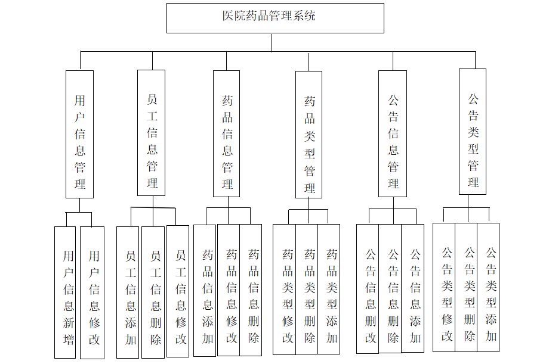
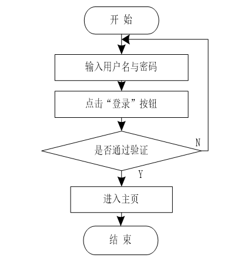
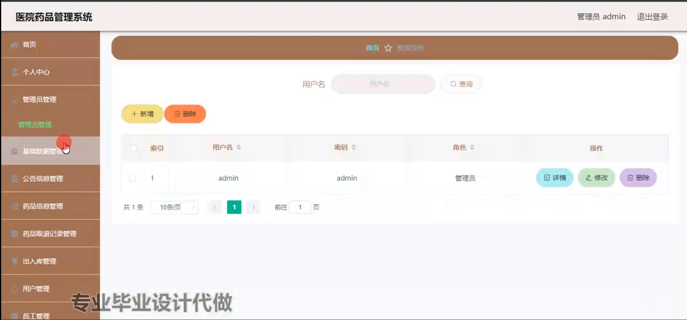
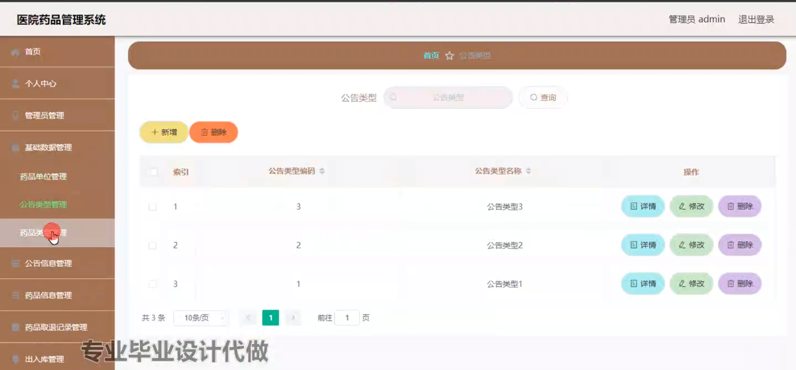
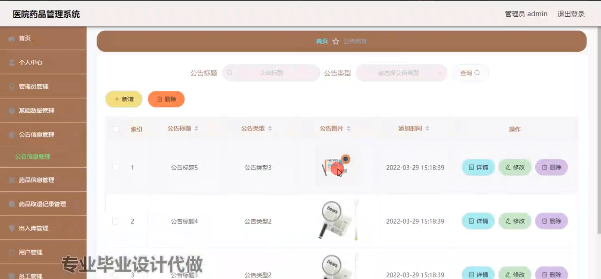
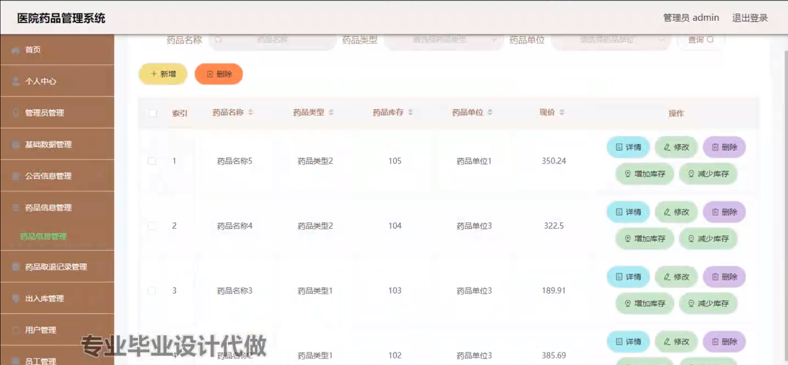
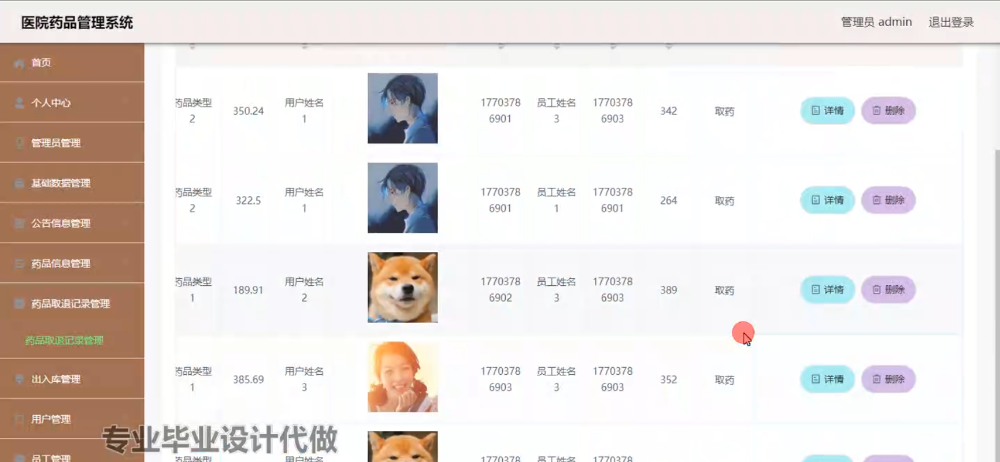
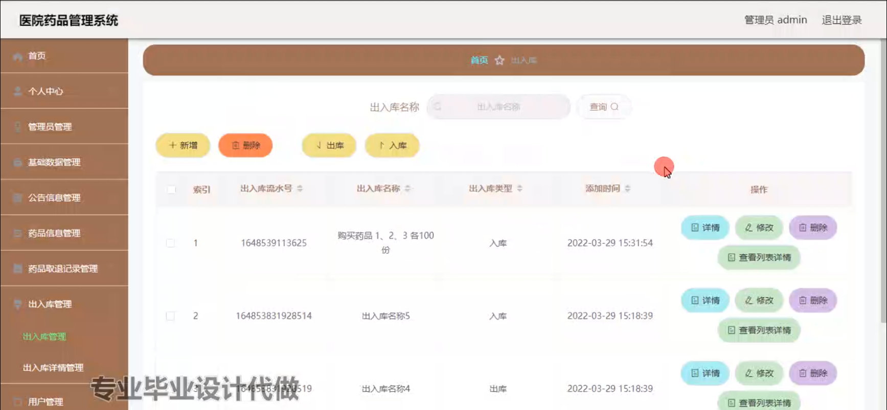
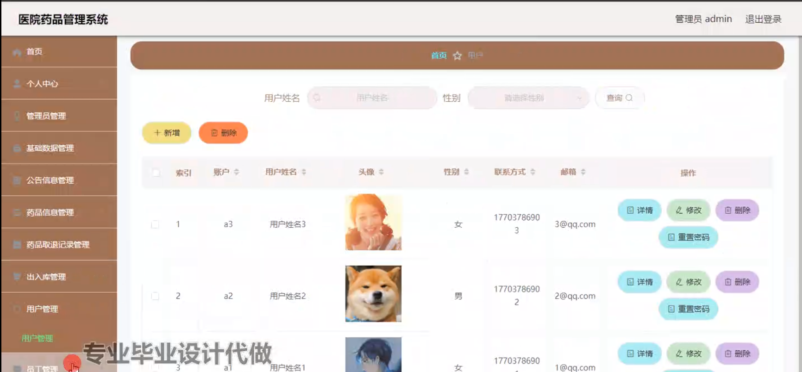
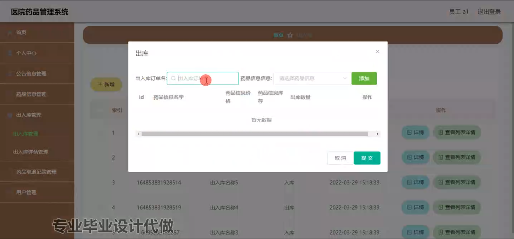

# 以医院药品管理系统为题的毕业设计采用springboot框架开发

#### 介绍

基于Spring Boot的医院药品管理系统是一款集成化的解决方案，旨在简化和优化医院内部的药品管理流程。该系统分为三个角色：管理端、员工端和用户端，每个角色具有不同的功能模块，以满足各自的需求。通过此系统，医院可以有效地管理药品的入库、出库、取药和退药记录，提高工作效率，减少人工错误，并确保药品的安全性和可追溯性。还在为毕业设计头疼吗？

#### 研究背景

身处网络时代，随着网络系统体系发展的不断成熟和完善，人们的生活也随之发生了很大的变化。目前，人们在追求较高物质生活的同时，也在想着如何使自身的精神内涵得到提升，而读书就是人们获得精神享受非常重要的途径。纸质版的校园失物比较沉重，携带不方便，而由于手机、平板不仅能够储存大量的校园失物信息数据，而且重量轻，可随身携带，因此现在的人们更愿意通过手机、平板等来进行在线阅读。由此，开发一款医院药品管理系统非常符合人们阅读的需求。  
过去人们看书需要到书店或者图书馆，而现在只要有网络，人们就可以通过手机、平板或电脑想什么时候看书就可以什么时候看，想看什么样的书就可以看什么样的书，非常的方便，并且人们把平时的闲碎时间全部利用起来进行阅读，使阅读效率大大提高，生活也变得丰富多彩起来。另外，通过医院药品管理系统，想要阅读哪本书，搜索下就能够快速找到，并且还可以对校园失物进行归类、统计和规范管理。该医院药品管理系统的界面非常清晰，使用简单，识字的人们都可以使用，并且它的功能齐全，能够满足各种各样的人的要求。

#### 技术栈

后端技术栈：Springboot+Mysql+Maven

前端技术栈：Vue+Html+Css+Javascript+ElementUI

开发工具：Idea+Vscode+Navicate

#### 系统功能介绍

管理端  
个人中心：管理员可以在此模块中查看和更新个人信息，包括用户名、密码等。  
管理员管理：管理其他管理员账户，分配权限，添加或删除管理员。  
基础数据管理：维护药品的基本信息，包括药品名称、规格、生产厂家等。  
公告信息管理：发布和管理医院内部公告，确保信息及时传达给相关人员。  
药品信息管理：详细记录药品的入库、库存、出库等信息，并进行实时更新。  
药品取退记录管理：记录药品的取用和退还情况，提供详细的查询和统计功能。  
出入库管理：管理药品的入库和出库操作，确保库存信息的准确性。  
用户管理：管理用户账户，包括患者的注册、信息更新等。  
员工管理：管理医院员工的账户和信息，分配工作任务。  

员工端  
个人中心：员工可以查看和更新个人信息，包含基本资料和登录信息。  
公告信息管理：查看医院发布的公告信息，及时了解最新动态和通知。  
药品信息管理：查询药品的详细信息，了解库存状况和药品使用情况。  
出入库管理：执行药品的入库和出库操作，确保药品流通的顺畅。  
药品取退记录管理：记录和查询药品的取用和退还情况，保证药品使用的透明度。  
用户管理：帮助患者进行账户管理和信息更新，提供必要的支持和服务。  

用户端  
个人中心：用户可以查看和更新个人信息，包括联系信息和病历记录等。  
公告信息管理：用户可以查看医院发布的公告信息，了解相关政策和通知。  
药品信息管理：用户可以查询药品的详细信息，了解药品的用途、剂量等。  
药品取退记录管理：用户可以查看自己取用和退还药品的记录，确保用药安全。  

#### 系统结构设计

系统结构设计就像一个树状结构一样，一个树干有很多分支，大任务相当于树干，小任务相当于树枝，只有需求分析信息弄清楚之后，才能保证每个小任务都能实现目标，对初步设计好的系统再进行不断优化，最终得到一个具体现实的系统结构。

#### 系统流程分析

注册流程

用户注册之后才可以登录系统，用户注册流程如下：

登录流程

用户需要登录系统之后，才可以进行校园失物评论、校园失物下载等操作。而管理员也只有登录系统之后，可以对系统各个方面的内容进行管理，不受任何限制。

#### 系统作用

医院药品管理系统通过信息化手段，实现了药品管理的标准化和自动化。具体作用如下：

提升工作效率：减少了人工操作的环节，药品管理流程更加高效。  
减少错误：系统化管理降低了手工操作的错误率，提高了药品信息的准确性。  
提高药品安全：通过详细记录药品的流通过程，确保药品的安全性和可追溯性。  
信息透明：所有药品的操作记录都可以追溯，提高了管理的透明度和责任感。  
用户友好：用户可以方便地查询药品信息和取退记录，提升了用户体验。  

#### 系统功能截图

登录

管理员管理

基础数据管理

公告信息管理

药品信息管理

药品取退记录管理

出入库管理

用户管理

员工端出库管理

用户端药品信息管理

#### 总结

基于Spring Boot的医院药品管理系统在现代医院管理中具有重要意义。通过提供全面的功能模块和便捷的操作界面，该系统不仅提升了药品管理的效率和准确性，还增强了药品管理的安全性和透明度。随着信息技术的不断发展，此类系统将在医疗管理中发挥越来越重要的作用，进一步推动医院管理的智能化和信息化发展。未来，该系统还可以结合更多的智能技术，如大数据分析和物联网设备，实现更为先进的药品管理解决方案。

#### 使用说明

创建数据库，执行数据库脚本 修改jdbc数据库连接参数 下载安装maven依赖jar 启动idea中的springboot项目

后台登录页面
http://localhost:8080/yiyuanyaopinguanli/admin/dist/index.html

管理员				账户:admin 		密码：admin

用户				账户:a1 		密码：123456

员工				账户:a1 		密码：123456